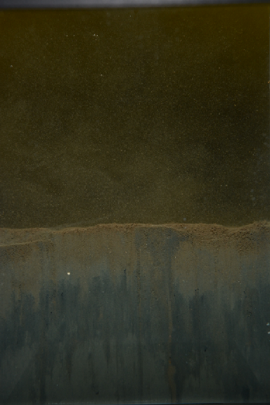
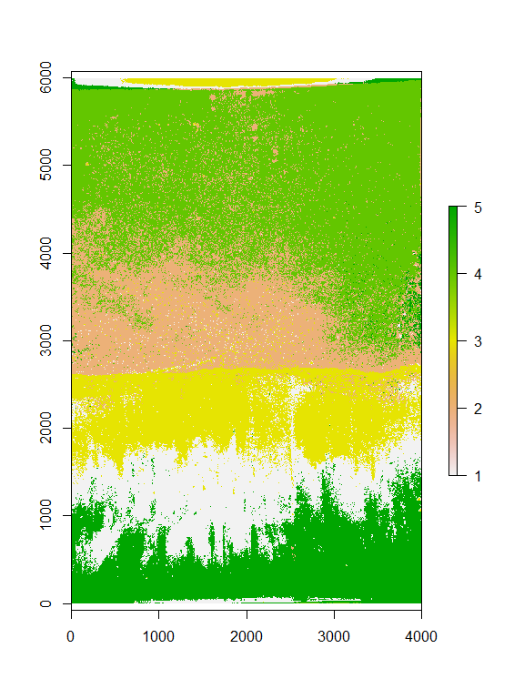
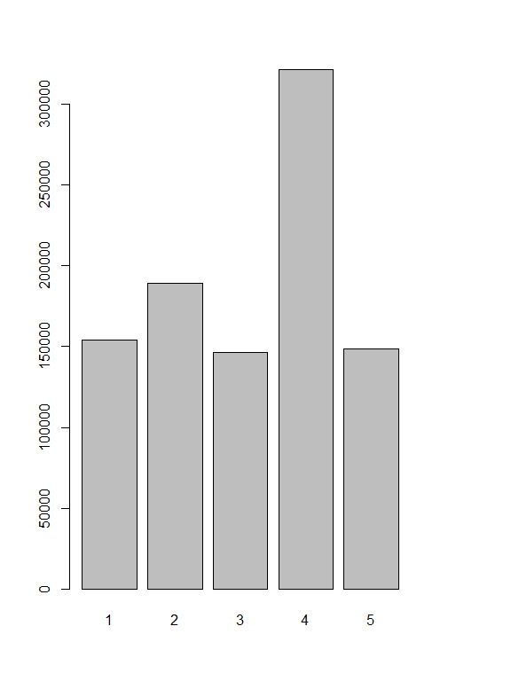

# README
Marcus W. Beck, beck.marcus@epa.gov  

### Image classification


```r
library(raster)
library(dplyr)
library(ggplot2)

# load and plot original image
img <- brick("ignore/BOB_0224_P5-2b.JPG")
plotRGB(img)
```




```r
# reduce resolution of original for speed
imgagg <- aggregate(img, fact = 5)

# format and classify with kmeans
cls <- as.data.frame(imgagg) %>% 
  kmeans(., 5, iter.max = 50) %>% 
  .$cluster

# back to raster for plotting
cls_rast <- matrix(cls, 
  nrow = imgagg@nrows,
  ncol = imgagg@ncols, 
  byrow = TRUE
  )
cls_rast <- raster(cls_rast, 
  xmn = imgagg@extent@xmin, 
  ymn = imgagg@extent@ymin, 
  xmx = imgagg@extent@xmax, 
  ymx = imgagg@extent@ymax
  )
plot(cls_rast)
```



```r
#barplot of cell counts by class
barplot(table(cls))
```



